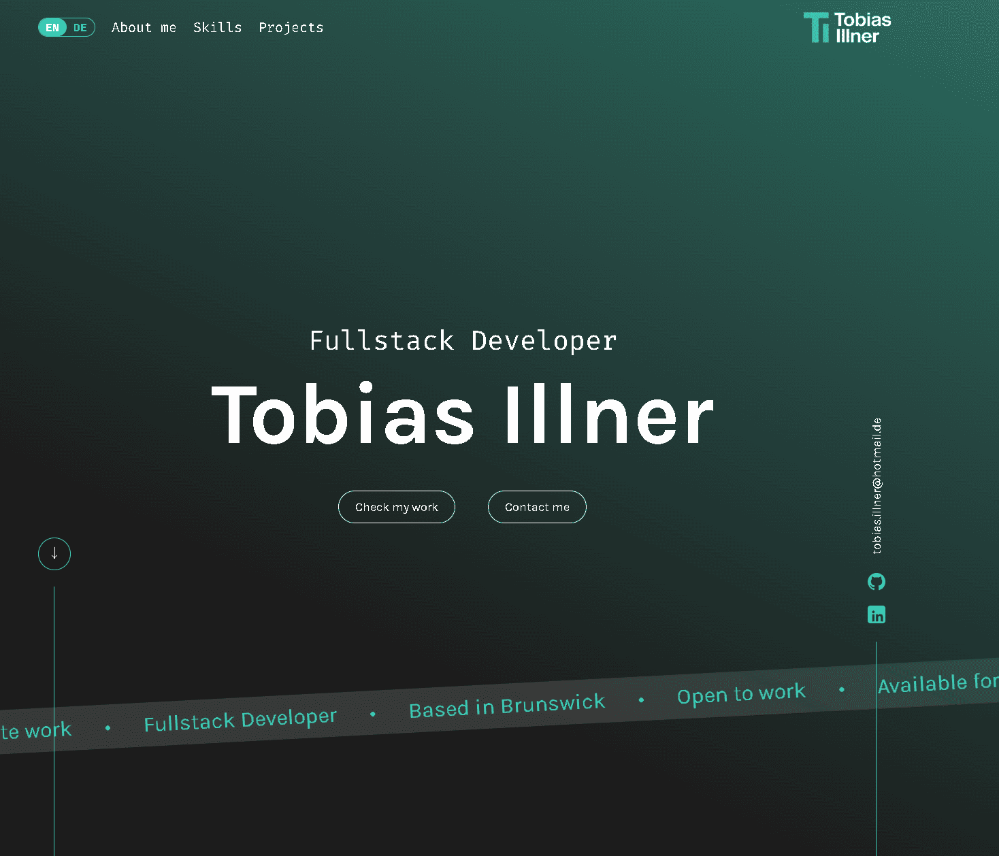

# Portfolio – Tobias Illner

My personal developer portfolio, built as a responsive single-page application with Angular. The website introduces me, showcases my skills and selected projects, and provides a direct way to get in touch.

[View Live Demo](https://tobias-illner.de/) · [GitHub Profile](https://github.com/TobiasIllnerDev) · [LinkedIn](https://www.linkedin.com/in/tobias-illner/)



## Features

- Responsive design for desktop, tablet, and mobile devices
- Language switching between English and German
- Browser-based persistence of the selected language
- Overview of my skills and technologies
- Interactive project showcase with GitHub links and live demos
- Contact form with validation and status messages
- Dedicated legal notice and privacy policy pages
- Smooth navigation between the different sections

## Technologies

- Angular 22
- TypeScript
- HTML5
- SCSS
- RxJS
- ngx-translate
- PHP for contact form delivery
- Vitest for unit testing

## Local Setup

A recent version of [Node.js](https://nodejs.org/) and npm is required.

```bash
git clone https://github.com/TobiasIllnerDev/Portfolio.git
cd Portfolio
npm install
npm start
```

The application will then be available at [http://localhost:4200](http://localhost:4200).

> The frontend can be viewed completely in a local environment. Sending messages through the contact form requires a PHP-enabled server environment.

## Available Scripts

| Command | Description |
| --- | --- |
| `npm start` | Starts the local development server and opens the browser |
| `npm run build` | Creates an optimized production build in the `dist/` directory |
| `npm run watch` | Automatically creates a new development build when files change |
| `npm test` | Runs the unit tests with Vitest |

## Project Structure

```text
src/
├── app/
│   ├── layout/          # Header and footer
│   └── pages/           # Portfolio sections and legal pages
├── styles/              # Global variables and styles
└── styles.scss          # Global stylesheet
public/
├── api/                 # PHP endpoint for the contact form
├── fonts/               # Locally hosted fonts
├── i18n/                # English and German translations
├── icons/               # Icons and technology logos
└── images/              # Images and project previews
```

## Author

Developed by [Tobias Illner](https://github.com/TobiasIllnerDev).
